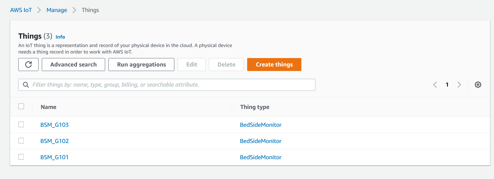

# AWS Bed Side Monitoring System Simulation 

This project demonstrates a patient bedside monitoring system on AWS Iot Core using generated sensor data. This project was done as a part of coursework for the Advanced Certification in Software Engineering by Great Learning and IIT-Madras.

## Get Started 
1. Setup your AWS account. 
2. Setup the AWS IoT Core Things as shown in the pictures below 




<!-- 

 -->

3. Create DynamoDB Tables as shown below 


4. Install the following libraries 
```
pip install awsiotpythonsdk boto3
```
5. Run the BedSideMonitor.py script with the following arguments.  
```
python BedSideMonitor.py -d device_id -e client_endpoint -r ..\root_certificate_path -c ..\device_certificate_path -k ..\device_private_key_path -id client_id -t channel_name 
```
You can run multiple instances of this script with different device_ids to generate synthetic data for multiple devices. Ensure that you run it for atleast an hour to generate a reasonable amount of data. 

4. Now run the database.py file to aggregate the data per minute with the following command.
```
python database.py -d device_id -s starting_time -e ending_time 
```
This will aggregate the data from the three sensors and save it to the agg table in dynamodb. 

5. Run the rulealerts.py file to perform a rule anomaly detection demo. 
```
python rulealerts.py -d device_id -s starting_time -e ending_time -c ..\config_file_path
```
